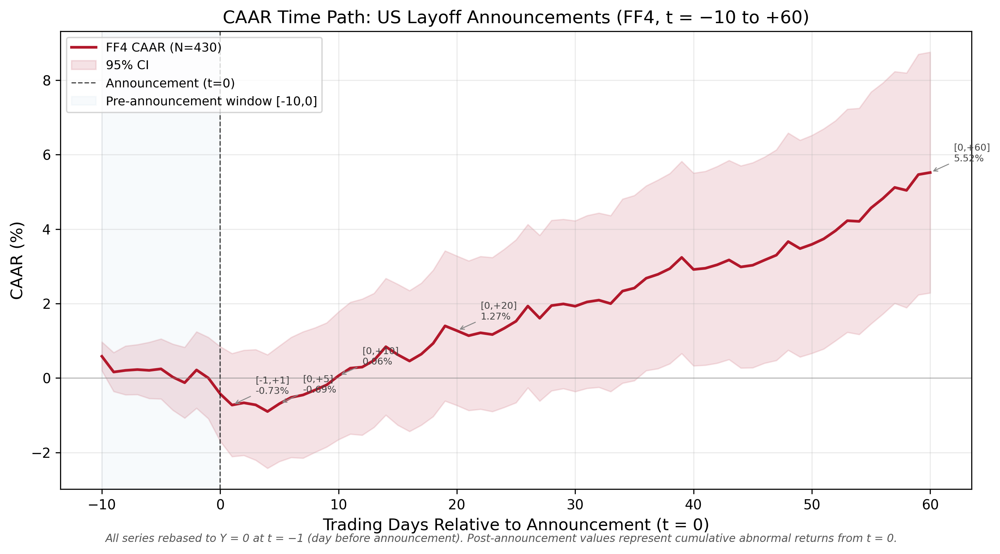
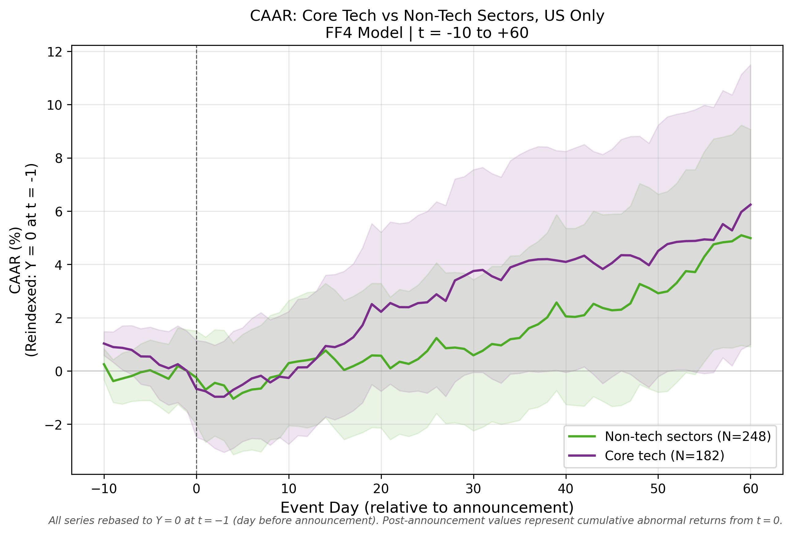
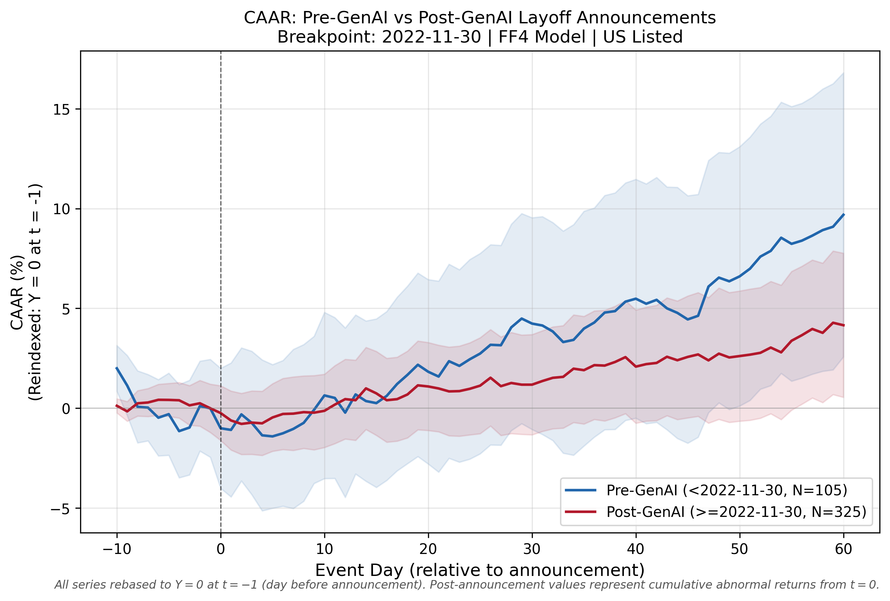
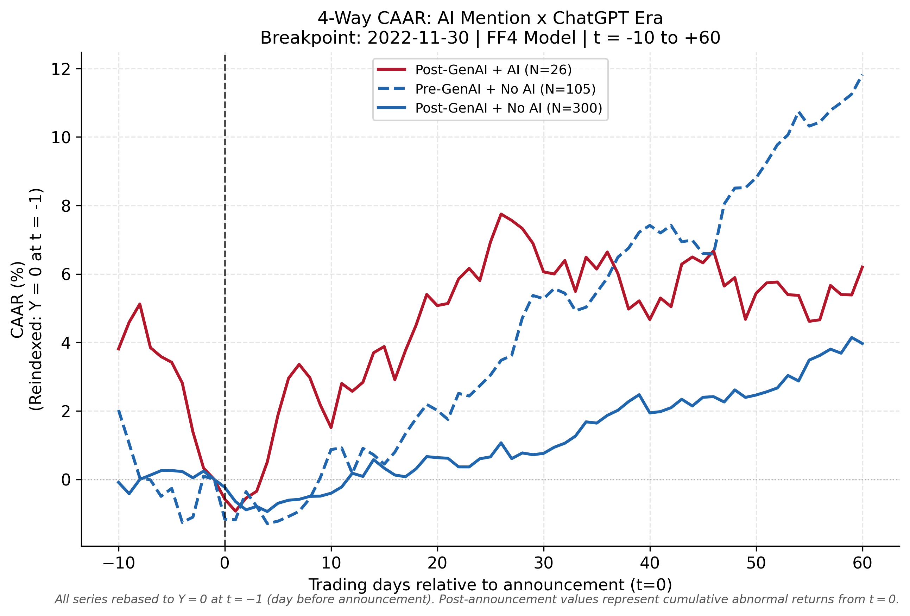

# Layoff Announcements and Stock Price Reactions: Market Efficiency in the Age of AI

**🌐 Language:** 　[中文](README.md)　|　**English (current)**

---

> **Study Type:** Empirical Finance — Event Study

> **Sample Period:** March 2020 – March 2024, publicly listed firms in technology and adjacent industries

> **Core Methods:** Carhart Four-Factor Model (FF4, Carhart 1997) + Staged Event Study + Cross-Sectional Analysis

> **Primary Sample:** U.S.-listed firms, N = 430 events; Established Firm Sample, N = 263 events; Core Technology Subsample, N = 182 events

---


## I. Research Overview

### H1: Layoff Announcements Exhibit a "Short-Negative, Long-Positive" Temporal Structure

Market reactions to layoff announcements are not unidirectional. Rather, they unfold in clearly distinct phases over time. The table below summarizes the key results from the Carhart Four-Factor Model (FF4) for the primary U.S. sample (N = 430):

**Summary (full results in Section VI, Table 3): CAAR by Window (FF4, U.S. Primary Sample, N = 430)**

| Event Window | CAAR | BMP *t* | Sig. | Economic Interpretation |
|---|---|---|---|---|
| $[-1,+1]$ | −0.952% | −2.52 | \*\* | Immediate negative announcement reaction; market interprets layoffs as a signal of operational distress |
| $[0,+5]$ | −0.676% | −1.98 | \*\* | Continued absorption of negative information; analyst follow-up reports reinforce negative sentiment |
| $[0,+10]$ | +0.076% | −0.90 | — | Expectations of cost savings offset concerns over potential revenue slowdown; net effect is statistically indistinguishable from zero. CAAR crosses zero precisely at **trading day T = +10** (+0.076%) |
| $[0,+20]$ | +1.287% | +0.79 | — | Positive but insignificant; cost-savings expectations and revenue concerns remain balanced |
| $[0,+60]$ | +5.235% | +2.84 | \*\*\* | Positive long-run drift; however, the calendar-time portfolio approach yields insignificant monthly alphas — this drift is most likely attributable to the broader tech market rally in 2023, not to a causal effect of layoff announcements |

*Note: \*\*\* p<0.01, \*\* p<0.05, \* p<0.10. Significance indicators are based on the BMP t-test (primary parametric test); Patell and Corrado are reported as robustness references.*

The CAAR path makes this temporal structure visually apparent. With the Y-axis re-indexed to zero at $t = -1$, the endpoint of each window in the figure corresponds exactly to the CAAR in the table. The **zero-crossing occurs approximately at trading day T = +10** ($[0,+9] = -0.173\%$ remains negative; $[0,+10] = +0.076\%$ turns positive).



*Figure 1: CAAR time path for U.S.-listed firm layoff announcements (FF4, N = 430, T = −10 to +60). Y-axis is re-indexed to zero at T = −1; CAAR values at window endpoints correspond exactly to those in Table 3. Shaded band represents 95% confidence intervals; blue-shaded region covers the pre-announcement window [−10, 0], used to verify the absence of systematic pre-announcement drift.*

Restricting the sample to established firms, the [-1,+1] CAAR drops to −0.451% (N = 263), approximately 53% smaller than the full-sample estimate of −0.952%. Focusing further on core technology firms (N = 182), the CAAR is −1.015%; among large-cap established tech firms (N = 56), it falls to −0.079%. **The negative signaling effect of layoff announcements is most pronounced among smaller, less liquid firms and substantially attenuated among large, established companies.**


### H2: AI Narratives Have Not Produced Differential Pricing in the GenAI Era

If AI truly altered the market's interpretation of layoffs, we would expect layoffs framed as AI-driven — particularly those announced after the release of ChatGPT — to elicit more positive (or at least less negative) stock price reactions than non-AI layoffs.

This study tests that hypothesis along three dimensions. The results consistently point in the same direction: while layoff announcements generate a genuine and nuanced market response (negative in the short run, recovering over time), **the emergence of generative AI has not produced meaningfully different pricing for AI-associated layoffs**. The narrative framing of workforce reductions as "AI transformation" has not been recognized by capital markets as an independent information signal.

**(1) Industry Grouping Does Not Support an AI Premium:** Three-day CAARs for core technology firms (N = 182) and non-technology firms (N = 248) are strikingly similar (−1.015% vs. −0.905%), and a Welch two-sample t-test confirms the difference is statistically negligible (t = −0.114, p = 0.909). If AI narratives were generating pricing effects, they should manifest most clearly in technology firms — yet the data provide no such evidence.



*Figure 2: CAAR time paths for core technology firms (N = 182) vs. non-technology firms (N = 248), U.S. sample (FF4, T = −10 to +60, Y-axis re-indexed to zero at T = −1).*

**(2) Pre- vs. Post-GenAI Comparison: Similar Magnitudes, No Evidence of Structural Change**

Splitting the sample at the ChatGPT release date (November 30, 2022), the aggregate [-1,+1] CAARs are −1.19% (Pre-GenAI, N = 105) and −0.87% (Post-GenAI, N = 325; see Table 6). Both periods exhibit the same short-run negative reaction (approximately −1%), and the difference of just 0.32 percentage points provides no basis for concluding that the emergence of generative AI changed the market's fundamental pricing logic.

In the [0,+5] window, the short-run decline is somewhat larger Pre-GenAI (−1.41%) than Post-GenAI (−0.44%), but given that the Pre-GenAI estimate is statistically insignificant and within the range of normal noise, this pattern cannot credibly support the claim that AI narratives have reshaped market pricing of layoff events.

The divergence in long-run drift is more pronounced: Pre-GenAI [0,+60] CAAR is +9.69% versus +3.80% Post-GenAI. This gap, however, most plausibly reflects differences in the macroeconomic backdrop — the Pre-GenAI window spans the 2021–2022 tech rally cycle, while the Post-GenAI period (primarily 2023) is characterized by rising interest rates and multiple compression — rather than any effect of AI framing.

Taken together, the overall pattern of announcement effects is highly consistent across the two periods. There is no statistical evidence that generative AI altered the way markets price technology-sector layoffs.

**Summary (full results in Section VI, Table 6): Pre- vs. Post-GenAI Event Study Comparison (FF4, U.S.)**

**A. Pre-GenAI Period (≤ November 29, 2022)**

| Event Window | All Events (N=105) | AI-Related (N=3)† | Non-AI (N=102) |
|---|---|---|---|
| [-1,+1] | −1.19% | +5.60% | −1.39% |
| [0,+5] | −1.41% | +5.36% | −1.61% |
| [0,+20] | +1.83% | +22.72% | +1.21% |
| [0,+60] | +9.69% | −27.99%† | +10.80% |

*† The Pre-GenAI AI-related subsample contains only N = 3 events; the [0,+60] mean (−27.99%) is dominated by individual observations and is not statistically representative.*

**B. Post-GenAI Period (≥ November 30, 2022)**

| Event Window | All Events (N=325) | AI-Related (N=26) | Non-AI (N=299) |
|---|---|---|---|
| [-1,+1] | −0.87% | −1.13% | −0.85% |
| [0,+5] | −0.44% | +2.01% | −0.65% |
| [0,+20] | +1.11% | +5.24% | +0.75% |
| [0,+60] | +3.80% | +6.48% | +3.56% |




*Figure 3: CAAR time paths for Pre-GenAI (N = 105) vs. Post-GenAI (N = 325) layoff announcements (FF4, U.S. sample, T = −10 to +60, Y-axis re-indexed to zero at T = −1). Split date: November 30, 2022.*

**(3) Post-GenAI Cross-Sectional Test:** With only N = 3 AI-related layoff events in the Pre-GenAI period (mean CAR +5.60%), severe sample imbalance precludes a credible within-period comparison. The analysis therefore relies on a staged event study design. In the Post-GenAI period, where the AI subsample is relatively more populated (AI: N = 26; non-AI: N = 299), the three-day stock price responses of the two groups show no significant difference (AI: −1.13% vs. non-AI: −0.85%, difference = −0.28%, p = 0.856). Even over the longer [0,+60] window, the incremental reaction of AI-related layoffs remains statistically indistinguishable from zero (AI: +6.48% vs. non-AI: +3.56%, difference = +2.92%, p = 0.702).




*Figure 4: CAAR time paths for four subgroups (AI/Non-AI × Pre/Post-GenAI), FF4, T = −10 to +60, Y-axis re-indexed to zero at T = −1. The Pre+AI group (N = 3) is omitted due to insufficient sample size (<5); the remaining three groups are Post+AI (N = 26), Pre+Non-AI (N = 102), and Post+Non-AI (N = 299).*


---

## II. Background

The technology sector has undergone a significant wave of workforce reductions in recent years. The most widely circulated interpretation in the media and among investors is that companies are actively substituting AI for human labor, and that markets view AI-driven layoffs favorably — treating them as signals of improved operational efficiency. Under this logic, layoff announcements should generate positive stock price reactions, particularly when companies explicitly attribute headcount reductions to AI-driven transformation.

An equally compelling alternative explanation, however, is that many of these layoffs simply represent corrections to pandemic-era over-hiring — the unwinding of headcount expanded during an anomalous growth period. Under this narrative, "AI transformation" is merely a rebranding exercise: a way to make a reactive retreat sound forward-looking. If this is closer to the truth, market reactions should be muted or even negative, as the announcement signals prior operational mismanagement rather than strategic initiative.

Both interpretations are plausible. Anecdotal evidence, however, is insufficient to characterize the aggregate market response. The central motivation of this study is to test these competing narratives rigorously using a large, systematically constructed dataset: how do markets actually respond to layoff announcements? Does the AI framing in corporate communications genuinely alter the market's pricing logic — or is it simply rhetorical packaging that generates no independent information value?

---
## III. Research Questions and Paper Structure

| # | Research Question | Analysis Module |
|---|---|---|
| **Q1** | How can a layoff event database be systematically constructed from multiple heterogeneous data sources, with consistent deduplication and standardization? | `scrapers/` + `analysis/01–02` |
| **Q2** | How are stock price and factor data obtained, and how are risk-adjusted cumulative abnormal returns computed using the FF4 model? | `analysis/04_event_study_ff4.py` |
| **Q3** | What are the short-, medium-, and long-term stock price effects of layoff announcements, and do these effects differ materially across firm types? | `analysis/04` + `analysis/08` |
| **Q4** | Following the release of ChatGPT, have AI-related layoffs elicited different market reactions relative to non-AI layoffs? Are these differences robust to alternative specifications? | `analysis/05–07` |

---
## IV. Data Construction


### 4.1 Multi-Source Integration and Deduplication (Q1)

The first challenge in constructing a layoff event database is that no single source simultaneously provides broad coverage, precise announcement dates, and reliable ticker information. Three source types each bring distinct strengths and limitations.

**layoffs.fyi** serves as the primary data source. This community-maintained platform tracks global technology-sector layoffs in real time, presenting data in Airtable-embedded tables with no public API. Data were collected by scripting a Playwright-based browser automation to navigate pagination, yielding 776 raw records. The platform's main advantage is breadth — it covers small-cap firms and international companies that would otherwise be missed. The main limitation is that announcement dates occasionally lag by several days, reflecting the inherent gap between internal company communications and public media coverage.

**EDGAR 8-K filings** provide a structured complement. U.S. public companies are legally required to file material event disclosures with the SEC within four business days of the triggering event, making date precision considerably higher than media-derived sources. Full-text searches were conducted using keywords including "workforce reduction," "restructuring," and "headcount reduction." The limitations of this source are its U.S.-only coverage and the fact that layoffs below a certain threshold relative to market capitalization may not rise to the level of a required material disclosure.

**Tech media outlets** (TechCrunch and similar sources) serve primarily a single purpose: providing text for AI annotation. Determining whether a given layoff announcement is genuinely AI-related requires access to the surrounding media narrative, not just the firm's official disclosure.

Deduplication across the three sources follows a seven-day rolling window rule: multiple records for the same firm within a seven-day period are collapsed into a single event, retaining the earliest date. After deduplication, ticker matching, and quality filtering (`event_study_usable == True`, requiring at least 100 valid trading days in the estimation window), **481 events pass all filters, of which 467 yield complete stock price data**.

The sample's geographic and industry composition is as follows:
- Geography: 441 U.S.-listed events (91.7%), 40 internationally listed (8.3%)
- Industry (30 categories): the six most represented are Healthcare (85), Transportation (78), Fintech (70), Consumer (61), Education (52), and AI (48)
- Time span: March 2020 to March 2024
- Firms with multiple layoff records: 114 firms, averaging 3.2 events each


**Why include all industries rather than restricting to technology firms?**

The data sources are naturally skewed toward technology companies, but this study retains the full cross-industry sample for two reasons.

First, pure technology firms are a minority within this dataset. Across 30 industry categories, non-technology sectors such as Healthcare (85 events), Transportation (78), and Fintech (70) are substantially represented, with non-technology industries collectively comprising the majority of observations. Restricting the sample to technology firms alone would eliminate more than half the observations, substantially reducing the statistical power of all tests.

Second, a broad cross-industry sample enables more meaningful sectoral comparisons. If the layoff announcement effect genuinely reflects AI narratives or efficiency signals, that effect should concentrate in technology firms — a proposition directly testable by comparing technology and non-technology subsamples. Conversely, if the effect is uniform across industries, it suggests the market is responding to more general macroeconomic signals rather than AI-transformation narratives specifically.

Technology sector analysis remains central throughout. A dedicated **core technology subsample** is constructed and analyzed in parallel with the full sample.


**Subsample I — Established Firm Sample (N = 263):**

Beyond the automated pipeline, this study constructs a more carefully curated subsample. The **Established Firm Sample** comprises firms listed on major exchanges (NASDAQ/NYSE) with complete post-IPO trading histories, excluding OTC pink-sheet stocks and companies in financial distress. All ticker assignments are verified through dual-source matching against Yahoo Finance and OpenFIGI. A manual review of 152 companies from the raw data removes pre-IPO firms, OTC-traded stocks, and distressed companies trading below $1.00 or at near-delisting risk during the event period.

After screening, 130 firms pass all filters, generating **263 layoff events** included in the FF4 event study. The sample ranges from large-cap technology blue chips such as AAPL, AMZN, and GOOGL to growth-stage firms with complete post-IPO trading histories, including COIN and ABNB.


**Subsample II — Core Technology Subsample (N = 182):**

To anchor the analysis more closely to the study's central phenomenon — technology-sector layoffs — a **Core Technology Subsample** is extracted from all U.S.-listed events. This subsample retains only firms classified under core technology and adjacent digital industries, including Hardware, Data/Software, Security, Infrastructure, AI, Crypto, Media, and digital product-related sectors, comprising **182 events** in total. This subsample serves as a supplementary specification in the cross-sectional analysis, allowing a direct test of whether noise from non-technology industries materially affects the full-sample conclusions.

The three subsamples — the full automated pipeline, the established firm sample, and the core technology subsample — are designed to be complementary: the full sample captures the complete cross-section of the layoff wave; the established firm sample controls for firm quality; and the core technology subsample anchors the analysis to the study's primary phenomenon of interest.


### 4.2 Stock Price Data and Factor Model (Q2)

**Stock price data** are downloaded from Yahoo Finance, retrieving daily adjusted closing prices for each event ticker and storing them as individual CSV files. Adjusted closing prices account for dividends and stock splits, enabling direct computation of log daily returns.

**The Carhart Four-Factor Model (FF4, Carhart 1997)** is downloaded from the Kenneth R. French Data Library at daily frequency, covering 2018 to 2026:

| Factor | Definition |
|---|---|
| MKT_RF | Market excess return (market portfolio minus risk-free rate) |
| SMB | Size premium (Small Minus Big) |
| HML | Value premium (High Minus Low, book-to-market) |
| MOM | Momentum factor (Carhart 1997, past 12-month winners minus losers) |

The rationale for selecting FF4 over the three-factor model centers on the MOM factor's particular relevance in this sample period. Technology stocks experienced a severe momentum crash in 2022 — high-valuation growth stocks that had surged in 2021 suffered concentrated drawdowns — followed by a sharp rebound in 2023. Without controlling for momentum, a portion of these price movements would be spuriously attributed to layoff announcement effects, introducing systematic bias into CAR estimates.

---


## V. Methodology


### 5.1 FF4 Event Study Framework

For each event $i$, the FF4 model is estimated over an estimation window spanning $t \in [-260, -11]$ trading days relative to the announcement date:

$$R_{i,t} - RF_t = \alpha_i + \beta_{1i} \cdot MKT\_RF_t + \beta_{2i} \cdot SMB_t + \beta_{3i} \cdot HML_t + \beta_{4i} \cdot MOM_t + \varepsilon_{i,t}$$

Using these parameter estimates, daily abnormal returns (AR) within the event window are defined as the difference between actual and model-predicted returns:

$$AR_{i,t} = (R_{i,t} - RF_t) - \hat{\alpha}_i - \hat{\beta}_{1i} \cdot MKT\_RF_t - \hat{\beta}_{2i} \cdot SMB_t - \hat{\beta}_{3i} \cdot HML_t - \hat{\beta}_{4i} \cdot MOM_t$$

Cumulative abnormal returns (CAR) are obtained by summing daily ARs over window $[t_1, t_2]$:

$$CAR_i[t_1, t_2] = \sum_{t=t_1}^{t_2} AR_{i,t}$$

Cumulative average abnormal returns (CAAR) aggregate across events:

$$CAAR[t_1, t_2] = \frac{1}{N} \sum_{i=1}^{N} CAR_i[t_1, t_2]$$

Events with $|AR| > 50\%$ on any single day are treated as anomalous observations attributable to OTC penny stocks or near-delisting distress and are excluded from the analysis.


### 5.2 Event Window Selection

Five event windows are employed:

| Event Window | Economic Meaning | Design Rationale |
|---|---|---|
| **[-1, +1]** | Three-day announcement window | **Primary reporting window.** Encompasses the day before the announcement (for early-leak detection) and the day after (for overnight reaction); provides the cleanest estimate of the pure announcement effect |
| **[0, +5]** | One week post-announcement | Full absorption period for the initial market reaction; covers the primary period for analyst follow-up report publication |
| **[0, +10]** | Two weeks post-announcement | Typical horizon for institutional portfolio adjustment; the CAAR zero-crossing falls precisely within this window (T = +10) |
| **[0, +20]** | One month post-announcement | Medium-term drift test: progressive information release around implementation progress and earnings reports |
| **[0, +60]** | Three months post-announcement | Long-run revaluation window; most susceptible to macroeconomic noise; requires supplementary interpretation via the calendar-time portfolio approach |


### 5.3 Three Statistical Tests

Three test statistics are reported for each window. **Significance indicators (\*/\*\*/\*\*\*) are based on the BMP t-test** — as BMP accounts for cross-sectional variance increases around the announcement and serves as the primary parametric test in this study. The Patell and Corrado statistics are reported alongside as robustness references.

**Patell (1976) Standardized Residual Test:** Each event's CAR is standardized by the residual standard deviation from the estimation window to produce a standardized CAR (SCAR); a z-test is then applied to the cross-sectional mean of SCARs. This test has high power in large samples but handles event-induced volatility changes poorly.

**BMP Test (Boehmer, Musumeci & Poulsen, 1991):** Extends the Patell framework by explicitly estimating cross-sectional variance, making it robust to structural shifts in return volatility around the announcement. The BMP t-statistic serves as the primary parametric test throughout this study.

**Corrado (1989) Nonparametric Rank Test:** Requires no distributional assumptions about abnormal returns; instead, it directly compares the rank of event-window ARs against the rank of estimation-window ARs. Given the well-documented leptokurtosis in technology stock returns, this distribution-free test provides an important robustness reference.


### 5.4 Construction and Definition of the AI Variable

The binary AI indicator variable (`ai_mentioned`) is constructed through full-text regular expression matching applied to the source news articles accompanying each layoff announcement. The labeling algorithm operates at two levels. **Strong matches** require the article to contain an explicit AI causal phrase — for example, "replacing workers with AI," "laid off due to automation," or "driven by generative AI." **Weak matches** require the presence of a specific AI technology term, including "artificial intelligence," "machine learning," "generative AI," "LLM," "ChatGPT," "OpenAI," or "automation," among others. An event is coded `ai_mentioned = 1` if either condition is satisfied. Article text is retrieved by scraping the source URL; approximately 42% of articles are inaccessible due to paywalls and are assigned a default value of zero. The systematic underdetection this introduces is addressed explicitly in the paywall sensitivity analysis in Section VII.

Within the primary U.S. sample (N = 430), `ai_mentioned = 1` for **29 events**, representing **6.7%** of the sample — 3 events in the Pre-GenAI period (≤ November 29, 2022) and 26 in the Post-GenAI period (≥ November 30, 2022). This positive rate is substantially lower than a naive substring-matching approach (triggering on any occurrence of "AI" or "artificial intelligence," which yields a ~50% positive rate and severe false positives) and substantially higher than an approach requiring explicit causal phrases only (~2% positive rate, with severe false negatives due to the relative rarity of direct causal language in news reporting). As alternative measures, this study also constructs three word-boundary-matched AI indicators — `ai_causal` (explicit causal statement only, N = 9), `ai_primary` (primary GenAI narrative framing, N = 22), and `ai_broad` (any AI technology term present, N = 74; all based on the full 467-event dataset) — and employs `ai_broad` in the paywall attenuation robustness checks in Section VII. Cross-validation confirms that `ai_mentioned` and `ai_broad` overlap substantially in the core sample, and the main conclusions are unchanged by the choice of AI variable.


---


## VI. Detailed Event Study Results


### 6.1 Main Event Study (Q3)

**Table 3: FF4 Event Study Results (U.S. Primary Sample, N = 430)**

| Event Window | N | CAAR | Patell Z | BMP t | Corrado | Sig. |
|---|---|---|---|---|---|---|
| [-1, +1] | 430 | **−0.952%** | −5.265\*\*\* | −2.516\*\* | −3.280\*\*\* | \*\* |
| [0, +5] | 430 | **−0.676%** | −3.280\*\*\* | −1.976\*\* | −2.714\*\*\* | \*\* |
| [0, +10] | 430 | +0.076% | −1.374 | −0.901 | −2.170\*\* | — |
| [0, +20] | 430 | +1.287% | +1.102 | +0.786 | −0.789 | — |
| [0, +60] | 430 | **+5.235%** | +4.064\*\*\* | +2.844\*\*\* | +0.792 | \*\*\* |

*Note: \*\*\* p<0.01, \*\* p<0.05, \* p<0.10. Significance indicators are based on the BMP t-test (primary parametric test); Patell and Corrado are reported as robustness references.*


*Figure 1: CAAR time path for U.S.-listed firm layoff announcements (FF4, N = 430, T = −10 to +60). Y-axis is re-indexed to zero at T = −1; CAAR values at T ≥ 0 correspond exactly to those in Table 3. Shaded band represents 95% confidence intervals; blue-shaded region covers the pre-announcement window [−10, 0], verifying the absence of systematic pre-announcement drift.*

>The results reveal a clear temporal structure (see Figure 1 and Table 3): significant negative reaction at announcement → continued negative drift during short-run absorption → reversal in the medium term, statistically insignificant (zero-crossing at precisely T = +10) → significant positive drift in the long run. The pre-announcement CAAR over [−20, −1] is only −0.82% (p = 0.287), confirming a clean event study design with no systematic information leakage.


### 6.2 Established Firm Sample vs. Full Sample

**Table 4: Established Firm Sample vs. U.S. Full Sample (FF4, [-1,+1] Window)**

| Sample | N | CAAR | Patell Z | BMP t | BMP p-value |
|---|---|---|---|---|---|
| U.S. Full Sample (primary) | 430 | −0.952% | −5.265\*\*\* | −2.516 | 0.012 |
| Established Firm Sample | 263 | −0.451% | −2.392\*\* | −1.084 | 0.280 |

>The Established Firm Sample (N = 263) exhibits a three-day CAAR approximately 53% smaller than the full sample, and the BMP test fails to reject the null at the 10% significance level (p = 0.280). **The market impact of layoff announcements does not follow a single universal pattern; its direction and magnitude depend substantially on how the market assesses the quality and financial standing of the announcing firm.**


### 6.3 Sector Comparison: Technology Firms Do Not Exhibit Stronger Reactions

**Table 5: Sector-Sorted CAAR Comparison (FF4, U.S.)**

| Sector Group | N | [-1,+1] CAAR | BMP | [0,+60] CAAR | BMP |
|---|---|---|---|---|---|
| Core Technology (14 industries) | 182 | −1.015%\*\*\* | −1.829\* | +5.854%\*\*\* | +2.036\*\* |
| Non-Technology | 248 | −0.905%\*\*\* | −1.759\* | +4.780%\*\* | +1.999\*\* |

>The [-1,+1] CAARs for core technology and non-technology firms are nearly identical (−1.015% vs. −0.905%); a Welch two-sample t-test confirms the difference is entirely insignificant (t = −0.114, p = 0.909). The negative signaling effect of layoff announcements is not a technology-sector phenomenon — regardless of industry, the market's initial reaction to workforce reduction announcements is similarly negative.


### 6.4 Pre- vs. Post-GenAI Temporal Comparison

**Table 6: Pre- vs. Post-GenAI Event Study Comparison (FF4, U.S.)**

**A. Pre-GenAI Period (≤ November 29, 2022)**

| Event Window | All Events (N=105) | t-stat | AI-Related (N=3)† | Non-AI (N=102) |
|---|---|---|---|---|
| [-1,+1] | −1.19% | −0.97 | +5.60% | −1.39% |
| [0,+5] | −1.41% | −1.12 | +5.36% | −1.61% |
| [0,+20] | +1.83% | +0.90 | +22.72% | +1.21% |
| [0,+60] | +9.69%\*\* | +2.71 | −27.99%† | +10.80% |

*† The Pre-GenAI AI-related subsample contains only N = 3 events; the [0,+60] mean (−27.99%) is dominated by individual observations and is not statistically representative. t-stat is a one-sample t-test of the mean CAR against zero (cross-sectional standard error); \*\* p<0.05, \* p<0.10.*

**B. Post-GenAI Period (≥ November 30, 2022)**

| Event Window | All Events (N=325) | t-stat | AI-Related (N=26) | Non-AI (N=299) |
|---|---|---|---|---|
| [-1,+1] | −0.87% | −1.66 | −1.13% | −0.85% |
| [0,+5] | −0.44% | −0.66 | +2.01% | −0.65% |
| [0,+20] | +1.11% | +1.05 | +5.24% | +0.75% |
| [0,+60] | +3.80%\*\* | +2.20 | +6.48% | +3.56% |

>*Key observations:*
- **Consistent aggregate effect:** Both Pre-GenAI and Post-GenAI periods exhibit short-run negative reactions of approximately −1%; the market's fundamental pricing logic has not changed with the advent of generative AI
- **Pre-GenAI period:** The absence of a credible AI comparison group (N = 3) limits inference to the aggregate result: a −1.19% short-run negative reaction
- **Post-GenAI period:** AI-related and non-AI layoffs display nearly identical response patterns, with no significant differences across any window
- **Sample imbalance:** The Pre-GenAI AI subsample (N = 3, mean CAR = +5.60%) is too small to support any reliable inference about "early AI effects"; in the Post-GenAI period, the AI subsample is relatively more populated (N = 26) but still shows no significant differential response


### 6.5 Post-GenAI AI Effect: Cross-Sectional Test (Q4)

**Table 7: Post-GenAI Cross-Sectional AI Comparison (Sample N = 325)**

| Event Window | AI-Related (N=26) | Non-AI (N=299) | Difference | SE (Diff.) | Welch t | p-value |
|---|---|---|---|---|---|---|
| [-1,+1] | −1.13% | −0.85% | −0.28% | 1.54% | −0.18 | 0.856 |
| [0,+5] | +2.01% | −0.65% | +2.66% | 2.97% | +0.89 | 0.379 |
| [0,+10] | +1.83% | −0.27% | +2.10% | 3.42% | +0.61 | 0.544 |
| [0,+20] | +5.24% | +0.75% | +4.49% | 6.45% | +0.70 | 0.493 |
| [0,+60] | +6.48% | +3.56% | +2.92% | 7.56% | +0.39 | 0.702 |

>While AI-related layoffs display numerically more positive reactions in certain windows (particularly [0,+20] and [0,+60]), **none of the differences reaches statistical significance** (minimum p-value = 0.379). Even in the Post-GenAI period, where the AI subsample is relatively more representative, there is no evidence that markets price AI-related layoff announcements at a premium.


### 6.6 Cross-Sectional OLS Regression (Full Sample)

To explore the predictive power of event characteristics for market reactions, a cross-sectional OLS regression is estimated on the event-level CAR[-1,+1] for the full sample (N = 429; one observation is dropped due to a missing control variable). Control variables include layoff scale, reduction ratio, market beta, prior six-month return, and financing history, among others. The central finding: across all specifications, R² falls between 1% and 4%, and **no single event characteristic robustly predicts short-run stock price reactions**.

This result is itself informative — the high idiosyncrasy of markets' immediate reactions to layoff announcements is consistent with semi-strong form market efficiency. One notable exception: `prior_6m_return` carries a coefficient of −11.67% (p = 0.014\*\*) in the long-run [0,+60] window, indicating that firms whose stock prices had already risen sharply before the announcement experience larger long-run downward corrections — a mean reversion effect.

---


## VII. Robustness Checks


### 7.1 Calendar-Time Portfolio Approach (Validating Long-Run Drift Causality)

Following Jaffe (1974) and Fama (1998), this study employs the calendar-time portfolio method: each month, an equal-weighted portfolio is constructed holding all firms that announced layoffs during that month; monthly portfolio excess returns are then regressed on the FF4 factors using time-series OLS. Results: monthly alphas are statistically insignificant across all subgroups (p > 0.10), with the exception of a marginally negative alpha in the Pre-GenAI period (t = −1.86, p = 0.073\*).

**Key finding:** The +5.235% positive CAAR in the [0,+60] window evaporates under the calendar-time approach, providing strong support for the interpretation that the long-run positive drift reflects the 2023 broad market rally rather than any causal effect of layoff events themselves. This also explains why Post-GenAI long-run CARs (+3.80%) are substantially smaller than Pre-GenAI (+9.69%) — the macroeconomic backdrop differs across the two windows, not the market's underlying pricing logic for layoffs.


### 7.2 Repeat Events and Pre-Announcement Drift

**Repeat events:** First-time layoff announcements yield CAAR[-1,+1] = −1.20%\*\* (N = 271); subsequent announcements show CAAR[-1,+1] = −0.42% (statistically insignificant, N = 157), consistent with information decay. (The two groups together sum to N = 428, two fewer than the primary N = 430; one of the missing observations corresponds to the same record excluded from the cross-sectional OLS due to a missing control variable; the second reflects a classification pending update in the robustness pipeline.) Market participants incorporate information about a firm's restructuring capacity upon the first announcement; each subsequent layoff conveys diminishing marginal information.

**Pre-announcement drift:** CAAR over [−20, −1] = −0.82% (p = 0.287), insignificant. A cross-sectional regression of CAR[-1,+1] on CAR[-20,-1] yields a coefficient of only 0.005 (p = 0.88). Together, these two tests rule out systematic insider trading or systematic information leakage, confirming that the causal identification assumptions underlying the event study design are satisfied.


### 7.3 Robustness of the Post-GenAI Cross-Sectional Test

Given the severe imbalance in the Pre-GenAI AI subsample (N = 3 vs. N = 102), the Post-GenAI cross-sectional test (Table 7) represents the most conservative available test of whether an AI pricing effect exists. Even in the period with the largest AI subsample (Post-GenAI, N = 26), markets show no significant differential pricing of AI-associated layoff announcements. This reinforces the robustness of the null-effect conclusion.

---


## VIII. Discussion and Future Research


### 8.1 Summary of Hypothesis Tests

Both core hypotheses of this study receive well-differentiated answers.

**H1 (Announcement Effect Structure): Supported.** Layoff announcements generate a genuine, time-varying market response — significantly negative in the short run (within one week), statistically insignificant in the medium term, and positive over the long run, though the latter is most plausibly attributable to macroeconomic confounds. This structure holds consistently across the full sample, the established firm sample, and the core technology subsample, with consistent directional signs and variation only in magnitude. Firm quality is the key moderator: the negative initial reaction is substantially attenuated for larger, more established companies.

**H2 (AI Narrative Premium): Not supported.** Three complementary tests yield the same conclusion:
- (1) **Sector grouping:** No significant difference between core technology and non-technology firms' [-1,+1] reactions (−1.015% vs. −0.905%, p > 0.1)
- (2) **Pre/Post-GenAI comparison:** Aggregate layoff reactions are nearly identical across periods (~−1%), with no evidence that generative AI altered market pricing logic
- (3) **Cross-sectional test:** In the Post-GenAI period, where the AI subsample is relatively well-powered (N = 26), AI-related layoffs show no significant pricing difference relative to non-AI layoffs (all windows p > 0.3)

The cumulative evidence indicates that markets do not differentially price layoffs framed as AI-driven, contradicting the hypothesis that "AI transformation" narratives materially shift investor expectations.


### 8.2 Open Questions on the "AI Narrative Premium"

The absence of a detectable AI pricing effect does not fully rule out the possibility that such an effect exists but falls below the detection power of this study due to sample constraints. The specific representativeness concerns are as follows:

- **The Pre-GenAI AI subsample is severely limited** (N = 3), making it impossible to establish credible parallel trends as a counterfactual baseline
- **The Post-GenAI AI subsample, while relatively better-populated (N = 26)**, still represents a roughly 11-to-1 imbalance with the control group (N = 299), potentially limiting power to detect small but genuine effects

Three avenues merit attention in future research:

1. **AI narratives in shareholder letters and earnings calls:** This study's AI annotation relies on media news text. Directly analyzing corporate annual reports and shareholder communications for explicit AI transformation commitments through NLP could yield a more precise measure of "management AI commitment intensity" and its relationship to market reactions.

2. **Validation against realized operating performance:** Layoff announcements reflect market expectations, not actual outcomes. Linking the layoff event sample to subsequent EPS growth and labor productivity changes would enable a meaningful test of whether the "AI efficiency story" reflects genuine value creation or strategic public relations packaging.

3. **Causal information extraction for AI attribution:** As LLM-based NLP tools mature, future research could move beyond keyword matching to extract causal claims — distinguishing statements in which AI is asserted as a direct cause of headcount reductions from those in which AI is merely mentioned as context. This would fundamentally resolve the measurement precision limitations inherent in the current approach.

---


## IX. Limitations

**Sample Representativeness:** This is the most fundamental constraint. AI-related layoff observations are sparse — N = 3 Pre-GenAI and N = 26 Post-GenAI — limiting the strength of causal inference available. Even the most conservative specification (Post-GenAI cross-sectional test, where the data are most adequate), the AI subsample is still roughly 12 times smaller than the non-AI comparison group. As AI-era layoff data accumulate, this constraint will naturally diminish.

**Measurement Error in AI Annotation:** Approximately 42% of news articles were inaccessible due to paywalls, generating systematic false negatives in the AI variable. Theoretically, this attenuates the estimated AI effect toward zero, making the null-effect conclusion conservative. If the true AI-association rate is higher than the estimated ceiling of 15.8% (the broadest alternative definition), some heterogeneous effect may go undetected.

**Causal Identification in Long-Run Drift:** The positive long-run CAR in the [0,+60] window disappears under the calendar-time portfolio approach, strongly suggesting that this drift reflects macroeconomic time confounds (the 2023 market rally) rather than the causal effect of layoff events. Long-run conclusions are therefore sensitive to the choice of time window.

**Endogeneity:** A sustained decline in stock prices may itself be a contributing cause of layoff decisions, introducing reverse causality. This study does not address this endogeneity — a common methodological constraint shared by event study designs generally — and future work would benefit from instrumental variable or natural experiment approaches.

**Confounding Events:** Technology companies frequently announce layoffs simultaneously with earnings releases. In such cases, the short-window CAR may reflect earnings surprises rather than the market's reaction to workforce reductions per se. Systematic identification and exclusion of these overlapping events remains a direction for future improvement.

**Survivorship Bias in Sample Construction:** The established firm sample excludes companies facing near-delisting risk or trading below $1.00 during the event period. This ex-post screening criterion may introduce bias. Future implementations should replace this with an ex-ante market capitalization threshold applied at the beginning of the sample period.

---


## X. Execution Pipeline

```bash
# ── Data Collection (one-time execution) ──
python scrapers/01_scrape_layoffs_fyi.py
python scrapers/02_scrape_edgar_8k.py
python scrapers/03_scrape_techcrunch.py
python scrapers/04_scrape_trueup.py
python scrapers/05_combine_sources.py

# ── Main Analysis Pipeline (run in order) ──
python analysis/01_collect_data.py          # Download stock prices and FF4 factor data
python analysis/02_enrich_events.py         # Enrich with industry, region, and initial AI labels
python analysis/03_relabel_ai_tiered.py     # Refined AI labeling (tiered definitions)
python analysis/04_event_study_ff4.py       # Main event study ★ (generates core results)
python analysis/05_did_regression.py        # Cross-sectional OLS ★
python analysis/06_robustness_checks.py     # Six robustness checks
python analysis/07_calendar_time_portfolio.py   # Calendar-time portfolio approach
python analysis/08_size_sector_analysis.py  # Size × sector analysis
python analysis/09_export_results.py        # Aggregate and export to Excel
```

**Key Output Files:**

| File Path | Contents |
|---|---|
| `data/processed/master_events_final.csv` | Master event table (481 events, all annotations) |
| `data/results/car_summary.csv` | CAAR summary (all subsamples × windows × models) ★ |
| `data/results/car_by_event.csv` | Event-level FF4 CARs (469 events) |
| `data/results/fig_caar_path_full.png` | CAAR time path figure (Figure 1) ★ |
| `data/results/did_crosssection/cross_section_v2.csv` | Cross-sectional OLS (four specifications) |
| `data/results/robustness/` | Robustness check suite (placebo / paywall / repeat events / drift) |
| `data/results/calendar_time/ct_results.csv` | Calendar-time portfolio monthly alphas |
| `data/results/FINAL_RESULTS.xlsx` | Consolidated results across all analyses (multi-sheet) ★ |
