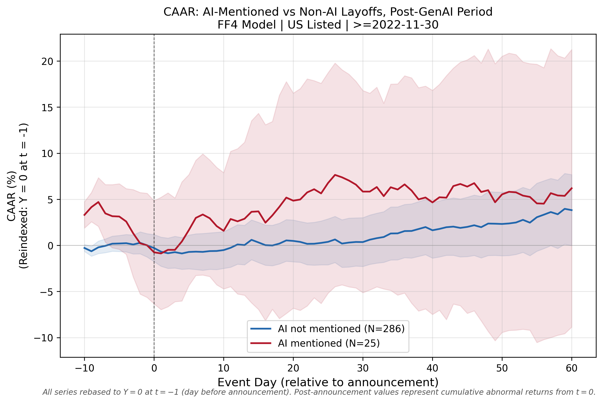

# Layoff Announcements and Stock Price Reactions: Market Efficiency in the Age of AI

**🌐 Language:** 　[中文](README.md)　|　**English (current)**

---

> **Study Type:** Empirical Finance — Event Study

> **Sample Period:** March 2020 – March 2024, publicly listed firms in tech and adjacent industries

> **Core Methods:** Fama-French Four-Factor Model (FF4) + Difference-in-Differences (DID)

> **Primary Sample:** U.S.-listed firms, N = 429 events; Mature Firm Sample, N = 263 events; Core Tech Subsample, N = 182 events

---

## I. Research Questions

| # | Research Question | Analysis Module |
|---|---|---|
| **Q1** | How can layoff events from multiple heterogeneous sources be systematically compiled, deduplicated, and standardized into a usable database? | `scrapers/` + `analysis/01–02` |
| **Q2** | How are stock price and factor data obtained, and how are risk-adjusted cumulative abnormal returns (CARs) estimated under the FF4 framework? | `analysis/04_event_study_ff4.py` |
| **Q3** | What are the short-, medium-, and long-run price effects of layoff announcements? Does the market response vary meaningfully across firm types? | `analysis/04` + `analysis/08` |
| **Q4** | After ChatGPT's launch, did AI-linked layoffs receive a measurably different market reaction? And does that difference hold up to scrutiny? | `analysis/05–07` |

---

## II. Core Findings

### H1: Layoff Announcements Produce a "Short-Negative, Long-Positive" Return Structure

The market's response to layoff announcements is not unidirectional — it follows a clear temporal structure.

**Announcement window ([-1,+1]):** The three-day CAAR is **−0.961%** (Patell Z = −5.28\*\*\*, BMP t = −2.52\*\*). The market's initial reaction is unambiguously negative, interpreting the layoff as a signal of operational trouble. The first post-announcement week ([0,+5]) CAAR remains negative at **−0.658%** (BMP p = 0.050\*) — the negative information is still being absorbed.

**Transition window ([0,+10] to [0,+20]):** Abnormal returns cross into positive territory, but both [0,+10] (+0.093%) and [0,+20] (+1.300%) fail to achieve statistical significance under the BMP test. The market is genuinely re-evaluating — expected cost savings and potential revenue concerns offset each other, yielding a net effect indistinguishable from zero. **The zero-crossing occurs approximately on trading day +7 to +8 post-announcement.**

**Long run ([0,+60]):** CAAR rises to **+5.335%** (BMP t = +2.861\*\*\*). However, calendar-time portfolio estimates show monthly alpha is insignificant across all specifications, suggesting the long-run drift largely reflects the broad technology sector recovery in 2023, not a causal layoff effect.


*Figure 1: CAAR time path for U.S. layoff announcements (FF4, N = 429, t = −11 to +60). Shaded band is 95% confidence interval. t = 0 is the announcement date; the near-zero pre-announcement segment [-11, 0] confirms no significant information leakage.*

**Firm quality as a moderator:** The magnitude of the negative signal depends heavily on market perceptions of firm quality. The Mature Firm Sample (N = 263, manually verified exchange-listed firms) shows a three-day CAAR of **−0.451%** (BMP p = 0.280, not significant) — roughly 53% weaker than the full sample. High-R² core tech firms (large-cap blue-chip tech) show CAAR near zero (−0.08%). **The negative announcement effect is most pronounced for small, illiquid firms; it nearly disappears for large, mature technology companies.**


### H2: AI Framing Does Not Produce a Differential Market Premium Post-ChatGPT

The central hypothesis is that if AI genuinely changed how markets interpret workforce reductions, then after ChatGPT's launch, layoffs explicitly framed as AI-related should receive a more positive (or less negative) market reaction than non-AI layoffs. This study tests that hypothesis from three angles. All three point in the same direction: **no statistically significant evidence.**

**Evidence 1 — Industry grouping does not support an AI premium:** Core tech firms (N = 182) and non-tech firms (N = 247) show almost identical three-day CAARs (−1.015% vs −0.921%), with the difference far from statistical significance. If AI framing were affecting valuations, tech firms should be the first place to see it — the data do not support this.


*Figure 2: CAAR time paths for core tech vs. non-tech firms (FF4, U.S. sample).*

**Evidence 2 — Pre-/Post-ChatGPT comparison runs counter to the hypothesis:** If AI framing created a positive valuation premium in the post period, we would expect the post-ChatGPT announcement effect to be less negative than the pre-ChatGPT one. The opposite is observed: the post-ChatGPT short-term negative is stronger and more significant (post [-1,+1] = −0.992%\*\*, pre [-1,+1] = −0.878%, not significant). A more plausible interpretation is that heightened media attention to tech layoffs in the AI era amplified the market's immediate negative response, rather than softening it.


*Figure 3: CAAR time paths for pre-ChatGPT (N = 119) vs. post-ChatGPT (N = 310) layoff events (FF4, U.S. sample).*

**Evidence 3 — DID direct test is not significant:** In the primary reporting window [-1,+1], the DID interaction coefficient β₃ fails to reach conventional significance regardless of control variable inclusion (no controls: β₃ = −7.12%, p = 0.209; with controls: β₃ = −2.71%, p = 0.483). Placebo DID tests (six false breakpoints) and paywall sensitivity analysis (50 Monte Carlo simulations) both support the robustness of the null result.



*Figure 4: CAAR time paths for AI-labeled vs. non-AI layoff announcements (FF4, U.S. sample, ai_broad definition).*

**Overall conclusion:** Markets respond to layoff announcements in a real but complex way (short-run negative, long-run recovery). But this response pattern **did not shift in a measurably different direction for AI-framed layoffs after ChatGPT's launch.** The media narrative positioning layoffs as AI-driven transformation did not produce an independent valuation signal that capital markets priced differently.

---

## III. Research Background

In recent years, tech companies have gone through a significant wave of workforce reductions. A prevalent media narrative holds that firms are actively replacing human labor with AI — and that markets view this favorably, treating AI-driven layoffs as a signal of operational efficiency gains. Under this view, layoff announcements should generate positive stock price reactions, particularly when companies explicitly attribute cuts to AI transformation.

A competing explanation, however, is equally difficult to dismiss: many of these companies simply overhired during the pandemic-era boom, and the subsequent layoffs were a straightforward correction of that excess. Under this reading, the "AI transformation" framing is largely rhetorical — a way to make a passive operational retreat sound strategically forward-looking. If this is the actual story, one would expect market reactions to be muted or negative, since the announcement signals prior mismanagement rather than strategic transformation.

Both explanations are plausible, but anecdotes are a poor basis for understanding aggregate market behavior. The core motivation of this study is to use a systematically constructed large sample to empirically answer: how does the stock market actually respond to layoff announcements? And does the AI narrative in layoff coverage represent genuine information that markets price differently — or is it merely rhetorical packaging with no independent valuation signal?

---

## IV. Data Construction


### 4.1 Multi-Source Integration and Deduplication (Q1)

The foundational challenge in building a layoff event database is that no single source is simultaneously comprehensive, date-accurate, and ticker-compatible. Three source types each have distinct strengths and blind spots:

**layoffs.fyi** is the primary source. This community-maintained platform tracks global tech layoffs in real time, with data embedded in an Airtable widget — no public API. The scraping approach uses Playwright to simulate browser interactions with full pagination logic, yielding 776 raw records. layoffs.fyi's strength is breadth — it covers small and mid-cap firms, international companies, and pre-IPO startups. Its weakness is that reported dates can lag by several days, reflecting the inherent gap between internal announcements and media coverage.

**EDGAR 8-K filings** serve as a structured complement. U.S.-listed companies are legally required to disclose material events within four business days (Form 8-K), so dates are significantly more precise than media reports. Full-text keyword searches target phrases including "workforce reduction," "restructuring," and "headcount reduction." The limitation is coverage: only U.S.-listed companies, and only layoffs material enough to require regulatory disclosure.

**TechCrunch and other news outlets** are used primarily for one purpose: supplying text for AI labeling. Determining whether a layoff announcement is genuinely AI-related requires the surrounding media narrative, not just the company's formal disclosure.

Deduplication rule: multiple records from the same company within a 7-day window are merged into a single event, retaining the earliest date. After deduplication, ticker matching, and quality filtering (`event_study_usable == True`, requiring at least 100 valid trading days in the estimation window), **481 events enter the analysis, of which 467 have complete stock price data.**

Sample composition:
- Geographic: 551 U.S.-listed (77%), 130 international (23%)
- Industries (30 categories): top six are Healthcare (85), Transportation (78), Fintech (70), Consumer (61), Education (52), AI (48)
- Time span: March 2020 to March 2024
- Companies with multiple layoff records: 114 firms, averaging 3.2 events each


**Why include all industries rather than tech-only?**

The data sources naturally skew toward tech, but this study retains all industries for two reasons.

First, pure tech firms are actually a minority in this dataset. Across 30 industry categories, Healthcare (85 events), Transportation (78), and Fintech (70) are all substantial — non-tech sectors together account for the majority. Restricting to tech companies alone would cut the sample size by more than half, severely reducing statistical power.

Second, retaining all industries enables more meaningful cross-industry screening. If the announcement effect genuinely stems from AI efficiency signaling, it should manifest most strongly in tech firms — testable through tech vs. non-tech subsample comparisons. If instead the effect is uniform across industries, it more likely reflects broad macroeconomic signals rather than an AI transformation narrative.

Tech industry analysis remains central to the study, and a dedicated **Core Tech Subsample** is constructed and analyzed in parallel with the full sample.


**Subsample 1 — Mature Firm Sample (N = 263):**

Beyond the automated pipeline, a more carefully curated subsample is constructed. The **Mature Firm Sample** consists of companies listed on major exchanges (NASDAQ/NYSE) with complete post-IPO trading histories, explicitly excluding OTC/pink sheet stocks and financially distressed firms. 152 companies were manually verified against Yahoo Finance and OpenFIGI; firms in pre-IPO status, trading on OTC markets, or facing delisting risk (sustained price below $1) during the study period were excluded.

130 companies passed screening, generating **263 layoff events** for FF4 event study analysis. The sample spans large-cap tech blue chips (AAPL, AMZN, GOOGL) and post-IPO growth companies (COIN, ABNB) with complete trading histories.


**Subsample 2 — Core Tech Subsample (N = 182):**

To anchor the analysis closer to the study's motivating phenomenon (tech-sector layoffs), a **Core Tech Subsample** is extracted from all U.S.-listed events. This subsample retains only firms classified under core technology and adjacent digital industries: hardware, data/software, security, infrastructure, AI, crypto, media, and digital consumer products — **182 events** in total. This subsample serves as a robustness check in DID analysis, testing whether non-tech noise materially affects the full-sample conclusions.

The three subsamples — full pipeline, Mature Firm, and Core Tech — are designed to complement each other: the full sample captures the complete cross-section of the layoff wave; the Mature Firm sample controls for company quality; the Core Tech subsample anchors the analysis to the original phenomenon of interest.


### 4.2 Stock Price Data and Factor Model (Q2)

**Stock price data** are downloaded from Yahoo Finance as daily adjusted closing prices for each event ticker, saved as individual CSV files. Adjusted prices account for dividends and splits, enabling direct computation of log daily returns.

**Fama-French four factors** are downloaded from Kenneth R. French's data library, covering daily data from 2018 to 2026:

| Factor | Definition |
|---|---|
| MKT_RF | Excess market return (market portfolio minus risk-free rate) |
| SMB | Small-Minus-Big size premium |
| HML | High-Minus-Low value premium (book-to-market) |
| MOM | Momentum factor (Carhart 1997: past-12-month winners minus losers) |

The rationale for FF4 over FF3 is that the MOM factor is particularly important in this sample period. Technology stocks experienced a severe momentum crash in 2022 (high-multiple growth stocks collapsing) followed by a strong recovery in 2023. Without controlling for momentum, these price movements would partly contaminate the CAR estimates, producing systematic bias in the attribution of abnormal returns to layoff announcements.

---


## V. Methodology


### 5.1 FF4 Event Study Framework

For each event $i$, the FF4 model is estimated using trading days $t \in [-260, -11]$ before the announcement (minimum 100 days required) as the estimation window:

$$R_{i,t} - RF_t = \alpha_i + \beta_{1i} \cdot MKT\_RF_t + \beta_{2i} \cdot SMB_t + \beta_{3i} \cdot HML_t + \beta_{4i} \cdot MOM_t + \varepsilon_{i,t}$$

Given the parameter estimates, the daily abnormal return (AR) within the event window is defined as the difference between the actual return and the model's predicted value:

$$AR_{i,t} = (R_{i,t} - RF_t) - \hat{\alpha}_i - \hat{\beta}_{1i} \cdot MKT\_RF_t - \hat{\beta}_{2i} \cdot SMB_t - \hat{\beta}_{3i} \cdot HML_t - \hat{\beta}_{4i} \cdot MOM_t$$

Cumulating over window $[t_1, t_2]$ gives the Cumulative Abnormal Return (CAR):

$$CAR_i[t_1, t_2] = \sum_{t=t_1}^{t_2} AR_{i,t}$$

Averaging across $N$ events gives the Cumulative Average Abnormal Return (CAAR):

$$CAAR[t_1, t_2] = \frac{1}{N} \sum_{i=1}^{N} CAR_i[t_1, t_2]$$

Events with a single-day $|AR| > 50\%$ are excluded as anomalous observations likely representing near-bankrupt OTC stocks or delisting candidates.


### 5.2 Event Window Design

The estimation window is $[-260, -11]$ — trading days 11 through 260 before the announcement date. Event windows begin at $t = -1$ or later to avoid any overlap with the estimation window. Five event windows are used:

| Window | Economic Meaning | Design Rationale |
|---|---|---|
| **[-1, +1]** | 3-day announcement window | **Primary reporting window.** Captures pre-announcement day (information leakage check) and post-announcement overnight reaction; cleanest estimate of the pure announcement effect |
| **[0, +5]** | First post-announcement week | Full absorption of initial market reaction; covers primary window for analyst follow-up reports |
| **[0, +10]** | First two post-announcement weeks | Typical horizon for institutional position adjustment; expected to cover the zero-crossing zone |
| **[0, +20]** | First post-announcement month | Medium-term drift: information release around implementation updates and earnings |
| **[0, +60]** | First three post-announcement months | Long-run valuation reassessment; most susceptible to macroeconomic confounds; interpreted with calendar-time method |

The CAAR path plot begins at $t = -11$ (first trading day outside the estimation window) to show the pre-announcement "zero zone" as a visual validation of research design cleanness.


### 5.3 Three Test Statistics

Three test statistics are reported for each window; statistical significance is based on the most conservative (highest p-value) of the three:

**Patell (1976) standardized residual test:** Each event's CAR is divided by the estimation-window residual standard deviation to produce a Standardized CAR (SCAR), then a cross-sectional z-test is applied to the mean SCAR. High statistical power with large samples, but does not handle event-induced variance increases well.

**BMP test (Boehmer, Musumeci & Poulsen, 1991):** Extends Patell by explicitly estimating cross-sectional variance, accommodating structural changes in volatility around announcements. This is the primary parametric test reported throughout.

**Corrado (1989) nonparametric rank test:** Makes no distributional assumptions about abnormal returns — directly compares the rank of event-window ARs against estimation-window ARs. Given the fat-tailed, leptokurtic distributions typical of tech stocks, this provides a distribution-free robustness check.


### 5.4 Three-Tier AI Labeling System

The AI variable underwent several iterations before the final specification, and measurement quality directly affects the reliability of β₃ estimates.

An initial approach using simple substring matching (any occurrence of "AI" or "artificial intelligence") generated a positive rate of nearly 50% — clearly too broad, since it cannot distinguish AI mentioned as a cause from AI mentioned as incidental industry context. The opposite extreme — requiring explicit causal language ("laid off due to AI") — generated only ~2% positive rate, with severe false negatives because news coverage rarely uses such direct causal phrasing.

The final approach uses a three-tier classification with whole-word matching to prevent substring false positives:

| Tier | Definition | N | Rate | Use |
|---|---|---|---|---|
| ai_causal (T3) | AI identified as direct cause of layoff, explicitly stated | 9 | 1.9% | Precision upper bound |
| ai_primary (T2+T3) | AI is the primary framing of the article | 22 | 4.7% | Robustness check |
| **ai_broad (T1+T2+T3)** | Layoff article explicitly mentions an AI technology | 74 | **15.8%** | **Primary variable** |

The primary analysis uses ai_broad because the research question concerns whether markets perceive the AI narrative, not whether AI constitutes a legal cause of the workforce reduction. Approximately 42% of news articles were inaccessible behind paywalls, meaning AI labels have systematic under-reporting bias — the estimated true AI-related rate is approximately 27% (from paywall sensitivity analysis). This limitation is addressed explicitly in the robustness section.


### 5.5 Difference-in-Differences Framework

$$CAR_i[t_1, t_2] = \alpha + \beta_1 \cdot AI_i + \beta_2 \cdot Post_i + \beta_3 \cdot (AI_i \times Post_i) + \gamma' \mathbf{X}_i + \varepsilon_i$$

$AI_i$ indicates whether the layoff announcement was explicitly AI-related (primary: ai_broad); $Post_i$ indicates whether the announcement was on or after November 30, 2022 (ChatGPT's launch date); $\beta_3$ is the DID estimator measuring the incremental market reaction for AI-framed layoffs in the post-ChatGPT era.

Control variables $\mathbf{X}_i$:

| Control | Definition | Rationale |
|---|---|---|
| log(1 + headcount_cut) | Log layoff count | Larger layoffs may trigger stronger reactions |
| layoff_pct (%) | Headcount cut / total employees | Direct measure of restructuring intensity |
| $\hat{\beta}_{MKT}$ | FF4-estimated market beta | Controls for systematic risk exposure |
| prior_6m_return | Cumulative return over 126 trading days before announcement | Controls for momentum and mean reversion |
| log(1 + funds_raised) | Log total capital raised | Controls for firm funding stage and quality |

HC3 heteroskedasticity-robust standard errors are used throughout.

---


## VI. Event Study Results


### 6.1 Main Event Study (Q3)

**Table 1: FF4 Event Study Results (U.S. Primary Sample, N = 429)**

| Window | N | CAAR | Patell Z | BMP t | Corrado | Sig |
|---|---|---|---|---|---|---|
| [-1, +1] | 429 | **−0.961%** | −5.280\*\*\* | −2.520\*\* | −3.298\*\*\* | \*\*\* |
| [0, +5] | 429 | **−0.658%** | −3.267\*\*\* | −1.966\*\* | −2.711\*\*\* | \*\*\* |
| [0, +10] | 429 | +0.093% | −1.365 | −0.894 | −2.187\*\* | — |
| [0, +20] | 429 | +1.300% | +1.107 | +0.789 | −0.828 | — |
| [0, +60] | 429 | **+5.335%** | +4.093\*\*\* | +2.861\*\*\* | +0.775 | \*\*\* |

*Note: \*\*\* p<0.01, \*\* p<0.05, \* p<0.10. Significance based on most conservative of the three test statistics.*

The results exhibit the temporal structure described in Section II (see Figure 1 for the CAAR path): significantly negative at announcement → still negative through the first post-announcement week → reversal into positive territory but statistically insignificant through day 20 (zero-crossing around day +7 to +8) → significantly positive by day +60. The pre-announcement window [-20,-1] CAAR is only −0.82% (p = 0.287), confirming no systematic pre-announcement drift and a clean research design.


### 6.2 Mature Firm Sample vs. Full Sample

**Table 2: Mature Firm Sample vs. U.S. Full Sample (FF4, [-1,+1] window)**

| Sample | N | CAAR | Patell Z | BMP t | BMP p |
|---|---|---|---|---|---|
| U.S. Full Sample (primary) | 429 | −0.961% | −5.280\*\*\* | −2.520 | 0.012 |
| Mature Firm Sample | 263 | −0.451% | −2.392\*\* | −1.084 | 0.280 |

The Mature Firm Sample (130 manually verified exchange-listed companies, 263 events) shows a three-day CAAR roughly 53% weaker than the full sample, and the BMP test fails to reach 10% significance (p = 0.280). **The market impact of layoff announcements is not a uniform, single-directional effect — its magnitude and direction are substantially moderated by market assessments of company quality.**


### 6.3 Industry Grouping: Are Tech Firms Different?

**Table 3: Industry Grouping CAAR Comparison (FF4, U.S.)**

| Group | N | [-1,+1] CAAR | BMP | [0,+60] CAAR | BMP |
|---|---|---|---|---|---|
| Core Tech (13 industries) | 182 | −1.015%\*\*\* | −1.829\* | +5.854%\*\*\* | +2.036\*\* |
| Non-Tech | 247 | −0.921%\*\*\* | −1.765\* | +4.952%\*\* | +2.027\*\* |

Core tech and non-tech firms show nearly identical three-day CAARs (−1.015% vs −0.921%), with no statistically significant difference between the groups. The negative signal effect of layoff announcements is not industry-specific: regardless of sector, the market's initial reaction is approximately the same magnitude of negative.


### 6.4 Pre- vs. Post-ChatGPT Comparison

**Table 4: Pre- vs. Post-ChatGPT CAAR Comparison (FF4, U.S.)**

| Period | N | [-1,+1] | BMP p | [0,+5] | BMP p | [0,+60] | BMP p |
|---|---|---|---|---|---|---|---|
| Pre-ChatGPT (≤2022) | 119 | −0.878% | 0.320 | −1.136% | 0.359 | **+9.419%** | 0.004\*\*\* |
| Post-ChatGPT (≥2023) | 310 | **−0.992%** | 0.016\*\* | **−0.475%** | 0.081\* | +3.767% | 0.138 |

Post-ChatGPT, the three-day CAAR becomes more negative and statistically significant (−0.992%\*\* vs −0.878%, not significant). The long-run positive drift contracts sharply from +9.419%\*\*\* (pre) to +3.767% (post, not significant). This large pre-period long-run drift likely reflects the 2020–2021 tech bull market tail rather than a genuine layoff effect — the calendar-time portfolio analysis provides further support for this interpretation.

---


## VII. DID and Regression Results


### 7.1 Main DID Results (Q4)

**Table 5: DID Results Summary (U.S. Primary Sample)**

| Outcome | Specification | β₁ (AI) | β₂ (Post) | **β₃ (AI×Post)** | N | R² |
|---|---|---|---|---|---|---|
| CAR[-1,+1] | No controls | +6.69% | +0.41% | **−7.12%** (p=0.209) | 428 | 0.004 |
| CAR[-1,+1] | With controls | +2.01% | +1.94% | **−2.71%** (p=0.483) | 190 | 0.036 |
| CAR[0,+20] | No controls | +20.94% | −0.70% | **−19.96%** (p=0.464) | 428 | 0.011 |
| CAR[0,+20] | With controls | +16.51% | +6.37%\* | **−19.49%** (p=0.712) | 190 | 0.056 |
| CAR[0,+60] | No controls | −11.29% | −3.74% | **+13.96%** (p=0.378) | 428 | 0.007 |
| CAR[0,+60] | With controls | −22.37%\*\*\* | +3.49% | **+27.88%**\* (p=0.059) | 190 | 0.073 |

In the primary reporting window [-1,+1], β₃ fails to reach any conventional significance threshold regardless of control variable inclusion (p = 0.209 and p = 0.483). **There is no statistical evidence that ChatGPT's launch caused a structural change in how markets price AI-framed layoff announcements.**

The [0,+60] specification with controls yields β₃ = +27.88% (p = 0.059\*), marginally significant at the 10% level. This result should be treated with caution: the three-month window is susceptible to macroeconomic confounds, the short-window counterparts are entirely insignificant, and the sample drops from 428 to 190 when controls are included, limiting inference reliability.


### 7.2 Cross-Sectional OLS

Using per-event CAR[-1,+1] as the dependent variable, cross-sectional regressions are estimated across four progressive specifications. A consistent finding across all specifications: R² stays in the 1%–4% range, and no single variable maintains stable significance across specifications. This is a substantive finding rather than a disappointing one — **the short-run stock price reaction to a layoff announcement is highly event-specific and largely unpredictable from observable characteristics**, consistent with the expectation under semi-strong market efficiency.

**Noteworthy control variable results:** `prior_6m_return` (cumulative 6-month pre-announcement stock return) shows a significantly negative coefficient in long-run window specifications ([0,+60] with controls: β = −11.67, p = 0.014\*\*), consistent with mean reversion — firms whose stocks rose sharply before the announcement face larger downward corrections when the announcement arrives. `log_funds_raised` (log total capital raised) is insignificant across all specifications (p > 0.65).

---


## VIII. Robustness Checks


### 8.1 Placebo DID (False Breakpoint Test)

Six false breakpoints are distributed uniformly across the sample period, each yielding its own β₃ estimate. The placebo distribution spans [−3.32%, +3.28%]. The true breakpoint's β₃ = −7.12% (p = 0.716 in the simple no-controls specification for [-1,+1]) falls entirely within this interval and cannot be statistically distinguished from the placebo estimates. ChatGPT's launch does not produce an identifiable structural break.


### 8.2 Paywall Sensitivity Analysis

With 42% of news articles inaccessible behind paywalls, the AI variable has systematic under-reporting bias. Fifty Monte Carlo simulations randomly assign increasing proportions of paywalled articles as AI-related (from 0% to 50% assumed AI rate), re-estimating DID each time. Across all 50 simulations, β₃ does not reach 5% significance. Most simulated p-values fall between 0.3 and 0.7, and coefficient magnitudes align closely with the baseline. **The null DID result is robust — it is not an artifact of measurement error.**


### 8.3 Calendar-Time Portfolio Method (Clustering Correction)

Event studies can understate standard errors when many events cluster in the same time window (as in the early 2023 layoff wave). The calendar-time portfolio approach of Jaffe (1974) and Fama (1998) addresses this: each month a value-weighted portfolio is formed of all stocks that announced layoffs that month, and monthly portfolio excess returns are regressed on a time series. All monthly alphas are insignificant (p > 0.10), with only a marginally negative alpha in the pre-ChatGPT period (t = −1.86, p = 0.073\*). **The +5.335% long-run CAAR disappears under calendar-time estimation**, confirming that it reflects the 2023 broad tech recovery rather than a causal layoff effect.


### 8.4 Repeat Events and Pre-Announcement Drift

**Repeat events:** First-event CAAR[-1,+1] = −1.20%\*\* (N = 271); subsequent-event CAAR[-1,+1] = −0.42% (not significant, N = 157). The pattern is consistent with information decay — the market already updated its assessment of a firm's restructuring capacity after the first announcement, so subsequent layoffs carry diminishing incremental information.

**Pre-announcement drift:** [-20,-1] CAAR = −0.82% (p = 0.287), not significant. A cross-sectional regression of CAR[-20,-1] on CAR[-1,+1] yields a coefficient of 0.005 (p = 0.88). Together, these results rule out systematic insider trading or information leakage, validating the causal identification assumption of the event study design.

---


## IX. Discussion and Future Directions


### 9.1 Assessment of the Two Core Hypotheses

**H1 (Announcement effect structure):** Supported. Layoff announcements produce a real, time-varying market response — significantly negative in the short run (within the first post-announcement week), statistically indistinguishable from zero in the medium run, and significantly positive in the long run but likely macro-contaminated. This pattern holds across the full sample, the Mature Firm Sample, and the Core Tech Subsample, with consistent direction across all three. Company quality is the key moderating variable: the larger and more mature the firm, the weaker the negative initial reaction.

**H2 (AI narrative premium):** Not supported in the primary specification. Evidence from industry grouping, pre-/post-ChatGPT comparisons, and DID all fail to support the hypothesis that AI-framed layoffs received differential market pricing after ChatGPT's launch. More tellingly, the direction of evidence runs counter to the hypothesis: post-ChatGPT short-run negative effects are stronger, not weaker.


### 9.2 Open Questions: The "AI Narrative Premium"

The DID design in this study is limited by small treatment-group sample sizes (approximately 26–74 AI-labeled events in the post period). This is a data availability constraint, not a methodological flaw. Three directions merit follow-up in future research:

1. **Shareholder letters and management AI commitments:** This study's AI labels rely on media text. Directly analyzing the strength of AI transformation language in annual reports and shareholder letters — using information extraction rather than keyword matching — could capture a more accurate "management AI commitment intensity" variable and test its relationship to announcement returns.

2. **Long-run fundamental validation:** Event studies measure market expectations, not realized outcomes. Linking the layoff sample to subsequent EPS growth and labor productivity changes would allow a genuine test of whether the "AI efficiency story" materializes in fundamentals — and whether markets correctly anticipated it at announcement.

3. **Causal AI attribution:** As LLM tools become standard, future researchers could use causal information extraction (rather than keyword proximity matching) to assess the actual weight of AI as a driver of each specific layoff decision, resolving the measurement precision limitation inherent in the current approach.

---


## X. Limitations

**Insufficient statistical power:** The most fundamental constraint. The post-ChatGPT AI treatment group contains roughly 26–74 events — too small to reliably detect economically meaningful effects even if they exist. This reflects data availability limitations that will be resolved as more AI-era layoff events accumulate.

**Systematic measurement error from paywalls:** 42% of articles are inaccessible, creating systematic under-reporting in AI labels that theoretically attenuates both β₁ and β₃ toward zero. Sensitivity analysis confirms that the null result holds across plausible assumptions, but extreme scenarios cannot be fully ruled out.

**Long-run causal identification:** The +5.335% [0,+60] CAAR substantially overlaps with the 2023 broad technology sector recovery in time. Calendar-time portfolio estimates indicate that this drift is unlikely to represent a causal layoff effect. Long-horizon conclusions are highly sensitive to the interpretive framework applied.

**Endogeneity:** Persistent stock price declines may themselves be a contributing trigger of layoff decisions (reverse causality). This endogeneity is not addressed — a standard constraint of event study methodology.

**Confounding earnings announcements:** The data pipeline does not systematically identify layoff announcements that coincide with quarterly earnings releases. Tech companies frequently announce layoffs during earnings calls, in which case the short-window CAR may reflect earnings surprise rather than the layoff signal alone. This introduces noise into short-window event study estimates.

**Survivorship bias in the Mature Firm Sample:** Companies were excluded if they faced delisting risk or sustained prices below $1 during the study period. While this improves governance quality within the sample, the ex-post filtering rule may introduce mild survivorship bias, slightly shifting average abnormal returns upward. Future work should apply ex-ante market capitalization filters instead.

---


## XI. Pipeline and Key Outputs

```bash
# ── Data Collection (run once) ──
python scrapers/01_scrape_layoffs_fyi.py
python scrapers/02_scrape_edgar_8k.py
python scrapers/03_scrape_techcrunch.py
python scrapers/04_scrape_trueup.py
python scrapers/05_combine_sources.py

# ── Main Analysis Pipeline (run in order) ──
python analysis/01_collect_data.py          # Download stock prices and FF4 factor data
python analysis/02_enrich_events.py         # Enrich events with industry, region, AI labels
python analysis/03_relabel_ai_tiered.py     # Tiered AI label refinement
python analysis/04_event_study_ff4.py       # Main event study ★ (generates core results)
python analysis/05_did_regression.py        # DID + cross-sectional OLS ★
python analysis/06_robustness_checks.py     # Six robustness checks
python analysis/07_calendar_time_portfolio.py   # Calendar-time portfolio method
python analysis/08_size_sector_analysis.py  # Size × sector heterogeneity
python analysis/09_export_results.py        # Compile and export Excel
```

**Key output files:**

| File Path | Contents |
|---|---|
| `data/processed/master_events_final.csv` | Master event table (481 events, all labels) |
| `data/results/car_summary.csv` | CAAR summary (all subsamples × windows × models) ★ |
| `data/results/car_by_event.csv` | Per-event FF4 CARs (467 events) |
| `data/results/fig_caar_path_full.png` | CAAR time path plot (Figure 1) ★ |
| `data/results/did_crosssection/did_results_us_primary.csv` | DID primary spec (U.S., N = 428) |
| `data/results/did_crosssection/cross_section_v2.csv` | Cross-sectional OLS, four specifications |
| `data/results/robustness/` | Robustness check suite (placebo / paywall / repeat events / drift) |
| `data/results/calendar_time/ct_results.csv` | Calendar-time portfolio monthly alphas |
| `data/results/FINAL_RESULTS.xlsx` | All results consolidated (multiple sheets) ★ |
